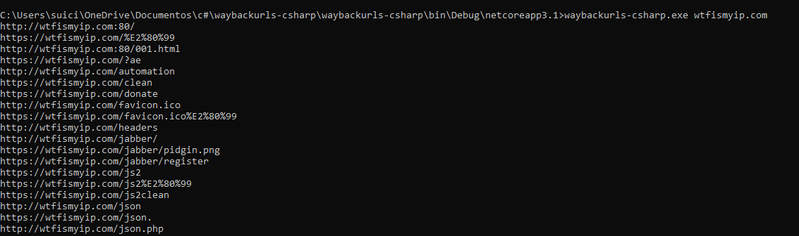
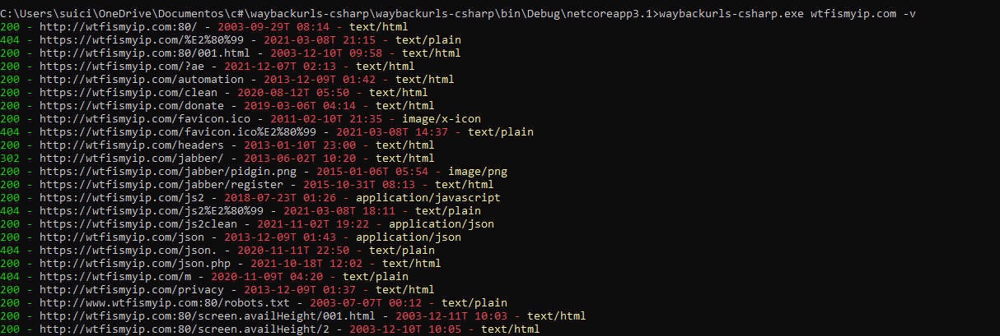

# Waybackurls
Fetch all the URLs that the Wayback Machine knows about for a domain. This program was written in C# and inspired by the classic waybackurls. I wanted to create my own C# version (to use as an executable on windows machines) so I created this one, with some differences. 

# Install
<h3>For windows:</h3>

```
git clone https://github.com/diego-tella/waybackurls
cd waybackurls\waybackurls
```
You can compile the program directly from Visual Studio (which I advise) or via the command line, like:
```
c:\windows\Microsoft.NET\Framework\v4.0.30319\csc.exe /reference:Newtonsoft.Json.dll /t:exe /out:waybackurls.exe *.cs
```
You need the `Newtonsoft.Json.dll` DLL to parse the json.

# Usage
Usage is simple. You run the program along with the link/domain you want to check the URLs saved in the wayback machine.
Exemple:
```
waybackurls.exe example.com
```
The program accepts three arguments as well:

<b>-v</b> - Verbose: A colored output with statuscode, timestamp and mimetype.

<b>-o</b> - Output: Save all output to a text file.

<b>-h</b> - Help menu.

```
waybackurls.exe example.com -v -o
```
# Images
<h3>Default</h3>

<h3>With verbose</h3>


# Credit
Credits to <a href="https://github.com/tomnomnom/waybackurls">tomnomnom</a> and <a href="https://gist.github.com/mhmdiaa/adf6bff70142e5091792841d4b372050">mhmdiaa</a>.
